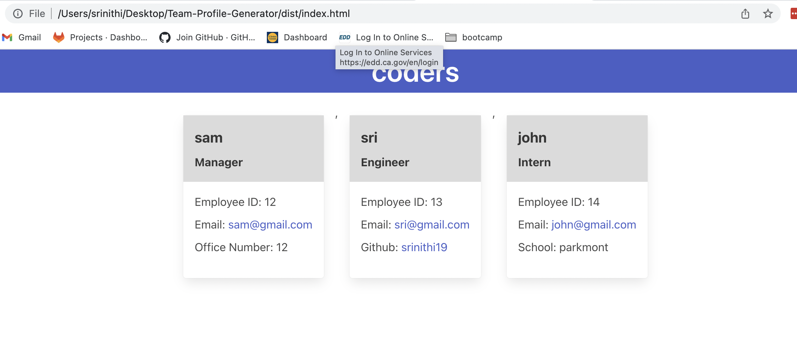

# Team-Profile-Generator

## Description

This application uses  command line interface that generates Team Profile as HTML page based on user inputs. Inquirer is used to prompt user with the set of questions to build their team profile. All the user inputs are validated and the user has an option to enter Engineer/Intern deatils once they enter their Manager info and a HTML file is generated for their team. Jest is used for writing unit test for all methods involved.

## Technology Used

| Nodejs | [https://nodejs.org/docs/latest-v16.x/api/](https://nodejs.org/docs/latest-v16.x/api/)     |  
| Inquirer | [https://www.npmjs.com/package/inquirer/v/8.2.4#question](https://www.npmjs.com/package/inquirer/v/8.2.4#question)     |  
| Jest | [https://jestjs.io/docs/getting-started](https://jestjs.io/docs/getting-started)     | 

## Usage

This app generates an HTML file by prompting user to enter their Team's info which includes Manager's Name, ID and Email and team name. Once this is done, user is prompted with another option to enter Engineer/Intern's details. If they select Enginner, then they will be asked to enter engineer Name, ID , emnail and Github info. If they select Intern, then they will be asked to enter intern Name, ID , emnail and school info.If they opt out, then an html file is generated with all the employee info with their team name as title.

Below is the list of questions inputted by user.

Once they enter all the info, HTML file is generated like  as shown here

I have used Jest to unit test the methods. Below is the "Pass" result for "npm run test"

## Demo

Walkthrough of team profile HTML file generated using this app is in the following link

Google drive link - (https://drive.google.com/file/d/187q6Y7zjyW9g2voxace2N1nhXSCtiNBa/view)

sample HTML file generated using this application is under "./dist/index.html"  

## Learning points

* using classes, inheritance and invoking class intances
* using jest to do unit test
* using inquirer for user input
* writing user input to a file and generate a html page

## Links

Github Repo - https://github.com/srinithi19/Team-Profile-Generator  
Application URL - https://srinithi19.github.io/Team-Profile-Generator/

